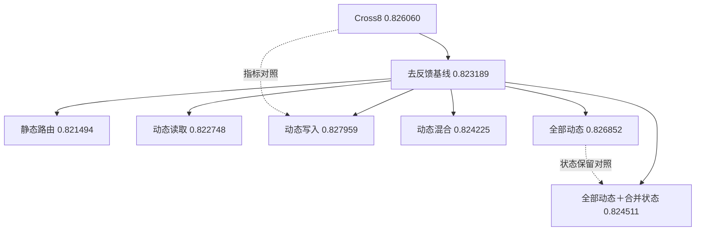

# 本轮实验血缘图

```mermaid
flowchart TD
 C[Cross8 0.826060] --> N[去反馈基线 0.823189]
 N --> S[静态路由 0.821494]
 N --> R[动态读取 0.822748]
 N --> W[动态写入 0.827959]
 N --> B[动态混合 0.824225]
 N --> A[全部动态 0.826852]
 N --> X[全部动态＋合并状态 0.824511]
 C -.指标对照.-> W
 A -.状态保留对照.-> X
```

仅包含本次8组。实线表示结构派生，虚线表示指标/消融对照；各模型固定seed从初始化独立训练，并非从父模型检查点继续训练。
